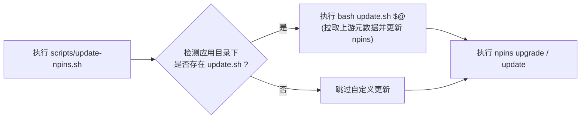

# 桌面应用（Apps）模块开发指南

本文档指导如何在 `modules/apps/` 下为桌面环境打包、沙箱隔离并添加新的应用程序。

---

## 统一工具抽象体系

为消除各 App 在 FHS 依赖、Bubblewrap 沙箱隔离、包装脚本与 Desktop 快捷方式创建中的样板代码，仓库在 [`modules/apps/lib/`](./lib/) 下提供了统一的抽象工具库（静态特化管线，零 `for` 循环遍历与运行时分支）：

- **[`lib/mk-sandboxed-app/`](./lib/mk-sandboxed-app/)**: 统一沙箱应用构建器目录，对外 API 为 `mkSandboxedApp.{base,desktopApp,electronApp,firefoxApp,qtApp,webkitApp,dotnetApp,wineApp}` 特化构造器与 `fhsBases` 共享基底：
  - [`default.nix`](./lib/mk-sandboxed-app/default.nix): 对外装配（`mkCore` 纯静态管线）。
  - [`types.nix`](./lib/mk-sandboxed-app/types.nix): ADT 定义（`Src` / `Icons` / `Sandbox` / `Env` / `Wine`，封闭集合，未知字段直接 `throw`）。
  - [`fhs-bases.nix`](./lib/mk-sandboxed-app/fhs-bases.nix): 共享 FHS 基底（`desktop-gui`、`desktop-gui-wine` 等高频组合预计算，`listToAttrs` O(n) 去重）。
  - [`sandbox.nix`](./lib/mk-sandboxed-app/sandbox.nix): 类型化 bwrap 参数生成器。
  - [`mk-unpacked.nix`](./lib/mk-sandboxed-app/mk-unpacked.nix): `Src` ADT 静态分发解包（含 `resolveArch`，原生支持 deb / tarball / zip / nsis / inno / msi 等无头解包）。
  - [`mk-launcher-env.nix`](./lib/mk-sandboxed-app/mk-launcher-env.nix): FHS `/etc/profile` 预烘焙环境（零 `for`/`grep`/`cat`）。
  - [`mk-wine-launcher.nix`](./lib/mk-sandboxed-app/mk-wine-launcher.nix): 专有 Wine 声明式前缀状态机引擎、CJK 注册表生成与 Windows 字体注入器。
  - [`mk-wrapper.nix`](./lib/mk-sandboxed-app/mk-wrapper.nix): 扁平 wrapper（`exec` + 单 `mkdir` 回退）。
  - [`mk-desktop.nix`](./lib/mk-sandboxed-app/mk-desktop.nix): `desktopItem` + 图标（单次 `find -exec`）+ 别名（`linkFarm`）。
  - [`mk-fhs-env.nix`](./lib/mk-sandboxed-app/mk-fhs-env.nix): 专用 FHS 构造器。
- **[`lib/mk-app-module.nix`](./lib/mk-app-module.nix)**: 统一 NixOS 模块生成器（`options.desktop.apps.<name>`、别名支持、`systemd.user.tmpfiles` 沙箱目录声明、`security.wrappers` 特权切换、Niri 规则集成）。
- **[`lib/fetch-with-retry.nix`](./lib/fetch-with-retry.nix)**: 统一通用源码与安装包多线程分块下载与断点续传机制（对外 API 为 `mkSandboxedApp.fetchWithRetry` / `fetchWithRetry`，兼容 `fetchDeb` 别名，通用支持 deb / tarball / zip / 独立二进制等各类安装包与源码；底层集成 `aria2c`，在构建期通过 `$NIX_BUILD_CORES` / `nproc` 根据宿主机 CPU 核心数自适应设定并发连接与分段数（`[2, 16]` 安全区间），原生支持原地断点续传、段级弹性重试与声明式请求配置（`userAgent` / `headers` / `extraAria2Opts`），在构建期由 FOD 执行，彻底消除评估期因 CDN 抖动中断构建的问题）。

---

## 目录结构规范

每个应用作为独立子目录维护在 `modules/apps/<app-name>/` 下，标准结构如下：

``` txt
modules/apps/<app-name>/
├── default.nix       # NixOS 模块定义（调用 mkAppModule，通常仅 5~10 行）
├── package.nix       # 声明式沙箱构建规范（调用 mkSandboxedApp，通常仅 20~30 行）
├── update.sh         # 可选：自定义上游版本抓取与 npins 更新脚本（针对非 Git/非 GitHub 源）
└── npins/            # 由 npins 依赖管理器维护的版本与哈希
    ├── default.nix   # npins 工具自动生成（禁止手动修改）
    └── sources.json  # 锁定的版本、下载源与 SHA-256（禁止手动编写）
```

> [!TIP]
> **自动发现机制**：[`modules/apps/default.nix`](./default.nix) 会自动扫描并引入 `modules/apps/` 下所有包含 `default.nix` 的应用子目录（自动忽略 `lib/` 工具库），**无需在上层手动注册路径**。

---

## 应用打包与隔离开发流程（4 步法）

### 步骤 1：通过 npins 锁定依赖版本

遵循项目的依赖管理规范（见 [AGENTS.md](../../AGENTS.md)），禁止在 Nix 表达式中手写 Hash。

1. **初始化 npins 目录**：

   ```bash
   mkdir -p modules/apps/<app-name>/npins
   npins -d modules/apps/<app-name>/npins init --bare
   ```

2. **添加上游依赖**：
   - **标准 GitHub Release / Git 仓库**：

     ```bash
     npins -d modules/apps/<app-name>/npins add github --at v1.0.0 <owner> <repo>
     ```

   - **特殊非 Git 来源（厂商 CDN / APT 软件源 / 归档 API）**：
     编写专用的 `update.sh` 自定义更新脚本（详见下文[自定义上游更新机制](#自定义上游更新机制-updatesh)），并执行：

     ```bash
     bash modules/apps/<app-name>/update.sh
     ```

---

### 步骤 2：编写软件包与沙箱声明 (`package.nix`)

创建 `modules/apps/<app-name>/package.nix`：

```nix
{ pkgs, lib ? pkgs.lib, mkSandboxedApp ? import ../lib/mk-sandboxed-app { inherit pkgs lib; } }:

let
  sources = import ./npins;
  rawVersion = sources.<pin-name>.version;
  version = lib.removePrefix "v" rawVersion;
  debUrl = "https://github.com/<owner>/<repo>/releases/download/v${version}/<app>_${version}_amd64.deb";
in
mkSandboxedApp.webkitApp {
  pname = "<app-name>";
  inherit version;
  src = { deb = mkSandboxedApp.fetchWithRetry sources.<pin-name>; };
  execPath = "bin/<executable>";

  # 共享 FHS 基底按构造器默认提供 (webkitApp = desktop-gui + webkitgtk);
  # 需增量依赖时显式扩展: fhsBase = mkSandboxedApp.extend mkSandboxedApp.fhsBases.desktop-gui-webkitgtk (pkgs: [ pkgs.foo ]);
  sandbox = { homeDirs = [ ".config/<app-name>" ]; };

  desktop = {
    desktopName = "<App Display Name>";
    genericName = "<Category Name>";
    comment = "<Description>";
    categories = [ "Network" "Utility" ];
    icon = "<app-name>";
  };
}
```

> 构造器选型：`base`（显式 `fhsBase`，支持 `multiArch` / `multiPkgs` 自定义双架构）· `desktopApp` · `electronApp` · `firefoxApp`（默认 `icons.firefox`）· `qtApp` · `webkitApp` · `dotnetApp` · `wineApp`（专有 Wine New WoW64 运行时与声明式前缀状态机）。
> `src` 仅接受 ADT（`{ deb = …; }` | `{ tarball = …; }` | `{ zip = …; }` | `{ nsis = …; }` | `{ inno = …; }` | `{ msi = …; }` | `{ custom = …; }`）；
> `sandbox` 为封闭集合（未知字段直接 `throw`），持久目录统一声明于 `sandbox.homeDirs`（由模块层 `systemd.user.tmpfiles` 预建，`wineApp` 自动预建 `wineprefix` 并开启 `privateTmp`）；
> `icons` 仅接受 ADT（`{ hicolor.auto = true; }` | `{ firefox = {}; }` | `{ none = true; }`）；
> 启动钩子仅接受静态字符串列表（`preRunHooks` / `fhsExtraCommands` / `postUnpackHooks` / `postBuildHooks`，`@UNPACKED@` 在构建期替换为解包路径）。

#### 附：Wine 应用程序声明范例 (`wineApp`)

针对 Windows 应用程序（通过 Portable Zip、NSIS 官方安装包、InnoSetup 安装包或 MSI 分发）：

```nix
{ pkgs, lib ? pkgs.lib, mkSandboxedApp ? import ../lib/mk-sandboxed-app { inherit pkgs lib; } }:

let
  sources = import ./npins;
in
mkSandboxedApp.wineApp {
  pname = "<app-name>";
  version = "1.0.0";

  # 构建期无头解包: 支持 nsis, inno, msi, zip (杜绝运行期弹窗安装向导)
  src = { nsis = mkSandboxedApp.fetchWithRetry sources.<pin-name>; };
  winExecPath = "<relative/path/to/executable.exe>";

  wine = {
    arch = "win64"; # "win64" (默认) 或 "win32"
    dxvk = false;   # 若为 3D/DirectX 应用，设为 true 可自动装配 Vulkan DXVK 2.x
    fonts = {
      enableOfficeFonts = true;   # 自动软链接 modules/fonts 微软中文字体 (SimSun/YaHei)
      enableCjkFallback = true;   # 自动下发 FontSubstitutes 与 FontLink 注册表映射
      enableFontSmoothing = true; # 开启 ClearType 抗锯齿平滑渲染
    };
    dllOverrides = {
      riched20 = "native,builtin";
    };
    drives = {
      "d:" = "Downloads"; # 映射受控的虚拟 D: 盘 (自动收敛危险的全局 Z: 盘)
    };
  };

  sandbox = {
    shareDownloads = true;
    sharedDirs = [ "Documents" ];
  };

  desktop = {
    desktopName = "<App Display Name>";
    genericName = "<Category Name>";
    comment = "<Description>";
    categories = [ "Utility" ];
    icon = "<app-name>";
  };
}
```

#### 附：Steam 应用程序声明范例

针对 Steam 客户端及 Proton 游戏运行环境（处理双架构 multilib、Bwrap-in-Bwrap 嵌套沙箱与外部驱动/库挂载）：

```nix
{ pkgs, lib ? pkgs.lib, mkSandboxedApp ? import ../lib/mk-sandboxed-app { inherit pkgs lib; }
, extraCompatPackages ? [ ]
, extraGameDirs ? [ ]
}:

let
  compatPaths = lib.makeSearchPathOutput "steamcompattool" "" extraCompatPackages;
  compatEnv = lib.optionalAttrs (extraCompatPackages != [ ]) {
    STEAM_EXTRA_COMPAT_TOOLS_PATHS = compatPaths;
  };

  # 64 位 Steam 运行时基础工具链
  steamTargetPkgs = pkgs: [ pkgs.bash pkgs.coreutils pkgs.zenity pkgs.curl pkgs.pciutils ... ];

  # 32 位与 64 位双架构运行时依赖库
  steamMultiPkgs = pkgs: [ pkgs.glibc pkgs.libGL pkgs.vulkan-loader pkgs.pipewire ... ];

  steamExtraCommands = [ "cp -f $out/usr/{bin,sbin}/ldconfig" ];
  steamProfile = ''
    unset GIO_EXTRA_MODULES
    export SDL_JOYSTICK_DISABLE_UDEV=1
    export GTK_IM_MODULE='xim'
    export LIBGL_DRIVERS_PATH=/run/opengl-driver/lib/dri:/run/opengl-driver-32/lib/dri
    ...
  '';
in
mkSandboxedApp.base {
  pname = "steam";
  version = pkgs.steam-unwrapped.version;
  src = { custom = pkgs.steam-unwrapped; };
  execPath = "bin/steam";

  # 显式声明双架构 FHS 基底
  fhsBase = mkSandboxedApp.mkMultiFhsBase {
    label = "steam-fhs";
    pkgsList = steamTargetPkgs;
    multiPkgsList = steamMultiPkgs;
  };

  privateTmp = true;
  fhsExtraCommands = steamExtraCommands;
  preRunHooks = [ steamProfile ];
  env = compatEnv;

  # 应用层显式按需申请特权与路径 (通用沙箱默认隔离输入硬件与游戏库)
  sandbox = {
    shareInput = true;       # 显式直通 /dev/uinput 与 /dev/input 支持手柄映射
    shareGames = true;       # 显式允许访问游戏存储目录
    shareMedia = true;       # 挂载 /mnt, /media 等外部媒体与游戏分区
    shareShm = true;         # 3D 游戏与 esync 共享内存
    sharedDirs = [ "SteamLibrary" ] ++ extraGameDirs;
    extraBinds = [ [ "/tmp/dumps" "/tmp/dumps" ] ];
    homeDirs = [ ".local/share/Steam" ".steam" ".cache" ];
  };

  aliases = [ "steam-run" ];

  desktop = {
    desktopName = "Steam";
    genericName = "游戏分发平台";
    comment = "在 Bubblewrap 沙箱隔离容器中运行 Steam 游戏与 Proton Windows 兼容环境";
    categories = [ "Network" "Game" ];
    icon = "steam";
    mimeTypes = [ "x-scheme-handler/steam" "x-scheme-handler/steamlink" ];
  };
}
```

##### Steam 与 Bwrap-in-Bwrap 架构原理

当在沙箱容器中运行 Steam 时，Steam 客户端及其自带的 Steam Linux Runtime (pressure-vessel) 会尝试在内部再次启动 `bwrap`（`srt-bwrap`）来为游戏创建隔离环境。重构后的自包含 Steam 配置通过以下设计协同解决嵌套沙箱与环境挂载问题：

1. **User Namespace 对齐与 Procfs 可见性**：外层 FHS 沙箱严格保持 `unshareUser = false`，不创建非特权用户命名空间，使内部的 pressure-vessel 能够如同在宿主机一样直接通过 `CLONE_NEWUSER` 建立嵌套容器，避免内核因嵌套非特权 userns 拒绝挂载 `/proc`（`Can't mount proc: Permission denied`）。
2. **多架构 FHS 与 Glibc LD Cache**：启用多架构 FHS（`multiPkgsList`），自动为 32 位与 64 位 Glibc 烘焙 `/etc/ld.so.cache` 并在启动时挂载，配合应用层 `fhsExtraCommands` 的 `cp -f $out/usr/{bin,sbin}/ldconfig` 实体拷贝，彻底杜绝 pressure-vessel 在嵌套扫描库依赖时的符号链接循环（symlink loop）与驱动缺失。
3. **双架构驱动与共享内存直通**：自动挂载 `/run/opengl-driver`（64位）与 `/run/opengl-driver-32`（32位），导出 `LIBGL_DRIVERS_PATH`、`__EGL_VENDOR_LIBRARY_DIRS`、`XDG_DATA_DIRS`，并通过 `shareShm = true` 直通 `/dev/shm` 确保大型 3D 游戏与 Proton esync/fsync 共享内存读写不受阻。
4. **游戏手柄与控制器直通**：应用层显式声明 `shareInput = true` 穿透 `/dev/uinput`、`/dev/input` 与 `/run/udev`（通用沙箱默认隔离输入以防范全局键盘监听），并在环境变量中预置 `SDL_JOYSTICK_DISABLE_UDEV=1`，使 SDL2 自动回退为 inotify 探测，完美支持手柄热插拔与 Steam Input 模拟。
5. **配套命令穿透**：通过别名注入 `steam-run`，当以 `steam-run` 命令行启动时自动解构为通用沙箱执行器（`exec "$@"`），在相同的多架构沙箱环境中运行任意命令。

---

### 步骤 3：编写 NixOS 模块入口 (`default.nix`)

创建 `modules/apps/<app-name>/default.nix`：

```nix
import ../lib/mk-app-module.nix {
  name = "<app-name>";
  description = "<App Display Name> 桌面应用程序";
  package = ./package.nix;
  # 可选：提供别名 (如 aliases = [ "app-alias" ];)
}
```

---

### 步骤 4：启用与验证

1. **在主机配置中启用**（例如 [`hosts/home-7950x/configuration.nix`](../../hosts/home-7950x/configuration.nix)）：

   ```nix
   desktop.apps.<app-name> = {
     enable = true;
   };
   ```

2. **运行静态断言与构建检查**：

   ```bash
   nix-build tests -A "home-7950x.staticCheck" --check
   ```

3. **依赖更新检查**：

   ```bash
   bash scripts/update-npins.sh -n
   ```

---

## 自定义上游更新机制 (`update.sh`)

### 1. 为什么需要自定义更新脚本？

`npins` 原生擅长跟踪 Git 分支和 GitHub Releases，但在桌面应用生态中，许多常用闭源软件、专有客户端或浏览器并不通过 GitHub Release 分发，例如：

- **官方私有 CDN / JSON 配置接口**（如 **腾讯 QQ NT** 通过 Rainbow 配置接口下发最新安装包）。
- **Linux 发行版 APT 软件仓库**（如 **微信 WeChat Universal** 托管在统信 UOS 官方应用商店源，版本索引记录在 `Packages.gz` 中）。
- **版本元数据 API + 归档文件服务**（如 **Firefox Developer Edition** 通过 Mozilla `product-details` API 发布版本号，安装包存储于 Archive 归档库）。

为了让这些非标准分发的应用同样能够实现全自动一键版本升级，并与仓库的 [`scripts/update-npins.sh`](../../scripts/update-npins.sh) 统一依赖更新流无缝协同，可在应用子目录下编写 `update.sh` 脚本。

---

### 2. 统一调度与执行机制

根目录的 [`scripts/update-npins.sh`](../../scripts/update-npins.sh) 会自动扫描 `modules/` 下所有带有 `npins/` 的模块与应用。执行流程如下：



> [!NOTE]
> **参数透传**：`scripts/update-npins.sh` 会将所有命令行参数（如 `-n` / `--dry-run`）直接透传给 `update.sh`。

---

### 3. 核心设计规范与开发准则

编写 `update.sh` 时必须遵循以下设计准则：

| 设计准则 | 规范要求与实现方法 |
| :--- | :--- |
| **严格脚本安全性** | 开头声明 `set -euo pipefail`，保证变量未定义或命令异常时及时拦截。 |
| **支持预检模式 (Dry-Run)** | 必须解析 `-n` 或 `--dry-run` 参数。在 Dry-Run 模式下仅输出拟更新的版本与 URL，**不得修改** `sources.json`。 |
| **工具链弹性与降级 (Fallback)** | - **JSON 解析**：优先使用 `jq`，回退使用 `python3 -c "import json..."`。<br/>- **npins 调用**：优先使用本地 `npins`，若未安装则通过 `nix shell nixpkgs#npins -c npins` 回退执行。<br/>- **Hash 转换**：优先使用 `nix hash convert`，回退使用 `python3` Base64 编码。 |
| **网络容错与优雅退出** | 当上游 API 或索引请求失败时，打印 Warning 并安全退出（`exit 0`），**禁止因单点网络波动阻断全局批量更新流程**。 |
| **链接有效性校验** | 在将 URL 写入 `npins` 之前，使用 `curl -s -o /dev/null -w "%{http_code}"` 验证 HTTP 状态码为 200 或 302 重定向。 |

---

### 4. 三大典型更新模式与实操样例

#### 模式 A：官方 CDN / JSON API 探测（以 QQ 为例）

适用于厂商提供了官方配置接口或更新查询 API 的场景。

- **工作原理**：请求接口获取最新的 deb 下载链接与版本号，与 `npins/sources.json` 对比，若有更新则调用 `npins add url`。
- **示例代码**（参考 [`qq/update.sh`](./qq/update.sh)）：

```bash
#!/usr/bin/env bash
set -euo pipefail

SCRIPT_DIR="$(cd "$(dirname "${BASH_SOURCE[0]}")" && pwd)"
NPINS_DIR="$SCRIPT_DIR/npins"

run_npins() {
    if command -v npins &>/dev/null; then
        npins "$@"
    elif command -v nix &>/dev/null; then
        nix shell nixpkgs#npins -c npins "$@"
    else
        echo "Error: npins or nix command not found." >&2; exit 1
    fi
}

DRY_RUN=0
for arg in "$@"; do
    [[ "$arg" == "-n" || "$arg" == "--dry-run" ]] && DRY_RUN=1
done

# 1. 请求官方 Rainbow 配置 API
CONFIG_JSON=$(curl -sSL "https://qq-web.cdn-go.cn/im.qq.com_new/latest/rainbow/pcConfig.json" || true)
[ -z "$CONFIG_JSON" ] && { echo "Warning: [qq] API fetch failed, skipping."; exit 0; }

# 2. 解析最新版本与下载链接 (jq / python3 降级)
NEW_URL=$(echo "$CONFIG_JSON" | jq -r '.Linux.x64DownloadUrl.deb // empty')
LATEST_VERSION=$(echo "$CONFIG_JSON" | jq -r '.Linux.version // empty')

# 3. 读取当前 sources.json 中的 URL
CURRENT_URL=$(jq -r '.pins.qq.url // empty' "$NPINS_DIR/sources.json" 2>/dev/null || true)

# 4. 比较并执行更新
if [ -n "$NEW_URL" ] && [ "$CURRENT_URL" != "$NEW_URL" ]; then
    HTTP_CODE=$(curl -s -o /dev/null -w "%{http_code}" -A "Mozilla/5.0" "$NEW_URL" || true)
    if [ "$HTTP_CODE" -eq 200 ] || [ "$HTTP_CODE" -eq 302 ]; then
        if [ "$DRY_RUN" -eq 1 ]; then
            echo "[qq] (dry-run) Would update to: $NEW_URL"
        else
            echo "[qq] Updating npins to: $NEW_URL"
            run_npins -d "$NPINS_DIR" add url --name qq "$NEW_URL"
        fi
        exit 0
    fi
fi
echo "[qq] Up to date (url: $CURRENT_URL)"
```

- **`package.nix` 动态解析与下载重试**：在 [`qq/package.nix`](./qq/package.nix) 中，通过 `builtins.match` 直接从 URL 中提取版本号，并通过 `src = { deb = mkSandboxedApp.fetchWithRetry sources.qq; };` 自动引入通用下载重试机制：

  ```nix
  version =
    let
      match = builtins.match ".*/(linuxqq|QQ)_([0-9.-]+)_.*" sources.qq.url;
    in
    if match != null then builtins.elemAt match 1
    else throw "qq: Could not parse version from URL: ${sources.qq.url}";

  src = { deb = mkSandboxedApp.fetchWithRetry sources.qq; };
  ```

---

#### 模式 B：APT 软件源索引解析与 SRI Hash 注入（以 WeChat 为例）

适用于软件分发在 Debian / Ubuntu / UOS 等 APT 软件仓库中，且需要自定义 User-Agent 绕过下载限制的场景。

- **工作原理**：
  1. 下载 APT 索引文件 `Packages.gz` 并用 `gzip -dc` + `awk` 解析目标包的 `Version`、`Filename` 和 `SHA256`。
  2. 将 16 进制 SHA256 转换为 Nix SRI Hash 格式（`sha256-...`）。
  3. 将新条目直接更新至 `sources.json`。
- **示例代码**（参考 [`wechat/update.sh`](./wechat/update.sh)）：

```bash
# 1. 拉取 UOS 软件源索引
UOS_BASE_URL="https://pro-store-packages.uniontech.com/appstore"
PACKAGES_URL="${UOS_BASE_URL}/dists/eagle-pro/appstore/binary-amd64/Packages.gz"
TEMP_DIR=$(mktemp -d); trap 'rm -rf "$TEMP_DIR"' EXIT

curl -sSL -A "debian APT-HTTP/1.3 (1.6.11)" "$PACKAGES_URL" -o "$TEMP_DIR/Packages.gz"

# 2. 解析 com.tencent.wechat 元数据
PKG_INFO=$(gzip -dc "$TEMP_DIR/Packages.gz" | awk '
BEGIN { found = 0 }
/^Package: com\.tencent\.wechat$/ { found = 1; next }
/^Package:/ { if (found) exit }
found && /^Version:/ { version = $2 }
found && /^Filename:/ { filename = $2 }
found && /^SHA256:/ { sha256 = $2 }
END { if (version && filename && sha256) print version " " filename " " sha256 }
')

# 3. 计算 SRI Hash 并更新 sources.json
NEW_HASH=$(nix hash convert --hash-algo sha256 --to sri "$SHA256_HEX")
# (如果处于非 dry-run 状态，将 { type: "Url", url: "$NEW_URL", unpack: false, hash: "$NEW_HASH" } 写入 sources.json)
```

- **`package.nix` 配合**：在 [`wechat/package.nix`](./wechat/package.nix) 中通过 `mkSandboxedApp.fetchWithRetry` 传入专属的 `userAgent`：

  ```nix
  src = mkSandboxedApp.fetchWithRetry {
    pin = wechatPin;
    userAgent = "debian APT-HTTP/1.3 (1.6.11)";
  };
  ```

---

#### 模式 C：版本字典 API + 归档 URL 模板（以 Firefox Developer Edition 为例）

适用于上游提供统一版本号字典 API，安装包按固定 URL 规范存储在 Archive / 镜像站的场景。

- **工作原理**：请求 Mozilla Product Details API 获取最新版本号字符串，拼接为归档下载链接，并通过 `npins add tarball` 更新。
- **示例代码**（参考 [`firefox-developer-edition/update.sh`](./firefox-developer-edition/update.sh) 与 [`firefox/update.sh`](./firefox/update.sh)）：

```bash
# 1. 抓取 Mozilla 官方版本字典
VERSIONS_JSON=$(curl -sSL "https://product-details.mozilla.org/1.0/firefox_versions.json" || true)

# 2. 提取 Developer Edition 版本号
LATEST_VERSION=$(echo "$VERSIONS_JSON" | jq -r '.FIREFOX_DEVEDITION // empty')

# 3. 拼接 Archive 归档下载 URL
NEW_URL="https://archive.mozilla.org/pub/devedition/releases/${LATEST_VERSION}/linux-x86_64/en-US/firefox-${LATEST_VERSION}.tar.xz"

# 4. 对比并更新 npins
if [ "$CURRENT_URL" != "$NEW_URL" ]; then
    run_npins -d "$NPINS_DIR" add tarball --name firefox-developer-edition "$NEW_URL"
fi
```

- **`package.nix` 配合**：在 [`firefox-developer-edition/package.nix`](./firefox-developer-edition/package.nix) 中通过 `src = { tarball = sources.firefox-developer-edition; }` ADT 由管线静态分发解压 `.tar.xz`，并通过正则从 URL 解析版本号：

  ```nix
  version =
    let
      match = builtins.match ".*/releases/([^/]+)/.*" sources.firefox-developer-edition.url;
    in
    if match != null then builtins.head match else "latest";
  ```

---

### 5. `package.nix` 与 `update.sh` 动态联动最佳实践

为了实现真正的“零手动介入更新”，建议 `package.nix` 与 `update.sh` 采用如下解耦规范：

1. **版本号动态提取**：永远不要在 `package.nix` 中硬编码固定版本号。对于 `type = "Url"` 或 `type = "Tarball"`，使用 `builtins.match` 从 `sources.<name>.url` 中动态提取。
2. **源码引用直通与多线程下载重试**：将 `sources.<name>` 包裹为 `src = { deb = mkSandboxedApp.fetchWithRetry sources.<name>; }` / `src = { tarball = mkSandboxedApp.fetchWithRetry sources.<name>; }` ADT（或通过 `mkSandboxedApp.fetchWithRetry` 传递特定 header 后同样包裹），由管线静态分发解包和 FHS 组装。`fetchWithRetry` 通用支持各类安装包与源码（deb / tarball / zip 等），底层基于 `aria2c` 实现多线程分块并发下载与断点续传，构建期根据 CPU 核心数自适应计算并发连接数（`[2, 16]` 安全区间），原生支持 `userAgent`、`headers` 与 `extraAria2Opts` 等声明式参数，由 Nix 统一在构建期作为 Fixed-Output Derivation 执行并支持分段原地容错重试，彻底消除评估期因 CDN 抖动中断构建的问题；解包管线内部亦包含 `ensureFetched` 兜底转换。
3. **一键全量维护**：执行 `bash scripts/update-npins.sh` 时，所有定制应用的 `update.sh` 会自动拉取最新版本，`npins/sources.json` 自动锁定哈希，Nix 配置无需任何手动代码修改即可构建最新版。

---

## 共享 FHS 基底清单

| 基底键 | 包含组件与适用场景 |
| :--- | :--- |
| **`desktop-gui`** | 通用桌面 GUI 元基底：整合基础 C 运行时、X11、Wayland、GPU 加速、PipeWire 音频、Fontconfig 字体及 GTK3 |
| **`desktop-gui-electron-media`** | `electronApp` 默认：桌面基底 + Electron/Chromium 运行时 + 多媒体编解码（如 QQ、VSCode） |
| **`desktop-gui-electron-media-xcb-qt`** | `qtApp` 默认：桌面基底 + Electron + 多媒体 + XCB/Qt5/Qt6（如微信 WeChat Universal） |
| **`desktop-gui-webkitgtk`** | `webkitApp` 默认：桌面基底 + WebKitGTK 4.1 与 libsoup3（如 Clash Verge Rev、Tauri 应用） |
| **`desktop-gui-dotnet`** | `dotnetApp` 默认：桌面基底 + .NET CoreCLR 运行时依赖（ICU、SQLite 等，如 v2rayN） |
| **`desktop-gui-media`** | `firefoxApp` 默认：桌面基底 + 完整多媒体与安全编解码库（FFmpeg、libvpx、NSS、NSPR 等，如 Firefox） |
| **`desktop-gui-wine`** | `wineApp` 默认：桌面基底 + Wine 纯 64 位 New WoW64 运行时 + 完整 GStreamer 多媒体编解码 + Vulkan/OpenGL 驱动 + Samba/CUPS/SANE + 字体排版设施 |

---

## 安全与沙箱规范摘要

| 隔离维度 | 实现方式 | 说明 |
| :--- | :--- | :--- |
| **宿主机 $HOME 保护** | `--tmpfs $HOME` | 容器无法接触宿主机 `~/.ssh`、`~/.gnupg`、工作文档与浏览器 Cookies |
| **数据持久化路径** | `--bind $SANDBOX_HOME $HOME` | 映射至 `~/.sandboxes/<app-name>`，重启或升级配置不丢失 |
| **外部媒体与游戏存储** | `--bind-try /mnt` / `/media` / `/run/media` / `/data` | 自动穿透挂载外部磁盘、移动存储与游戏库分区 (`shareMedia = true` / `shareGames = true`) |
| **游戏手柄与控制器** | `--dev-bind-try /dev/uinput` / `/dev/input` / `/run/udev` | 默认隔离；应用声明 `shareInput = true` 时允许访问物理控制器与虚拟摇杆 |
| **进程共享内存 (IPC)** | `--bind-try /dev/shm` | 保证 3D 游戏与 Proton esync/fsync 大容量共享内存互操作 |
| **图形显示与双架构驱动** | `--ro-bind-try /run/opengl-driver*` / Wayland / X11 | 穿透 32/64 位 Vulkan/OpenGL 驱动及 Wayland/X11 协议通道 |
| **音频服务** | `--ro-bind-try $XDG_RUNTIME_DIR/pipewire-0` | 仅只读穿透 PipeWire / PulseAudio Socket |
| **输入法服务** | `--ro-bind-try $XDG_RUNTIME_DIR/fcitx5` / `bus` | 仅只读穿透 Fcitx5 与 DBus 通信通道，支持中文输入 |
| **网络通道** | `--share-net` | 允许正常的网络通信 |

---

## 参考样例

| 应用名称 | 关键特性 / 依赖 Profile | 模块与构建规范 | 自定义更新脚本 |
| :--- | :--- | :--- | :--- |
| **QQ (Linux QQ NT)** | Electron, Media, 官方 Rainbow API 探测 | [`qq/default.nix`](./qq/default.nix) · [`qq/package.nix`](./qq/package.nix) | [`qq/update.sh`](./qq/update.sh) |
| **微信 (WeChat Universal)** | XCB, Electron, APT Packages.gz 解析, 自定义 UA | [`wechat/default.nix`](./wechat/default.nix) · [`wechat/package.nix`](./wechat/package.nix) | [`wechat/update.sh`](./wechat/update.sh) |
| **Firefox Developer Edition** | Wayland, Media, Tarball, Mozilla API 模板 | [`firefox-developer-edition/default.nix`](./firefox-developer-edition/default.nix) · [`firefox-developer-edition/package.nix`](./firefox-developer-edition/package.nix) | [`firefox-developer-edition/update.sh`](./firefox-developer-edition/update.sh) |
| **Firefox** | Wayland, Media, Tarball, Mozilla API 模板 | [`firefox/default.nix`](./firefox/default.nix) · [`firefox/package.nix`](./firefox/package.nix) | [`firefox/update.sh`](./firefox/update.sh) |
| **Clash Verge Rev** | WebKitGTK, GTK3, GitHub Release 依赖 | [`clash-verge/default.nix`](./clash-verge/default.nix) · [`clash-verge/package.nix`](./clash-verge/package.nix) | *(标准 npins 托管)* |
| **v2rayN** | .NET CoreCLR, Avalonia, GitHub Release 依赖 | [`v2rayn/default.nix`](./v2rayn/default.nix) · [`v2rayn/package.nix`](./v2rayn/package.nix) | *(标准 npins 托管)* |
| **Visual Studio Code** | Electron, Media, 官方重定向 | [`vscode/default.nix`](./vscode/default.nix) · [`vscode/package.nix`](./vscode/package.nix) | *(npins MutableUrl 原生托管)* |
| **Visual Studio Code Insiders** | Electron, Media, 官方重定向 | [`vscode-insiders/default.nix`](./vscode-insiders/default.nix) · [`vscode-insiders/package.nix`](./vscode-insiders/package.nix) | *(npins MutableUrl 原生托管)* |
| **Microsoft Edge** | Chromium/Electron, Media, 微软 APT 源 Packages.gz 解析 | [`microsoft-edge/default.nix`](./microsoft-edge/default.nix) · [`microsoft-edge/package.nix`](./microsoft-edge/package.nix) | [`microsoft-edge/update.sh`](./microsoft-edge/update.sh) |
| **Microsoft Edge Dev** | Chromium/Electron, Media, 微软 APT 源 Packages.gz 解析 | [`microsoft-edge-dev/default.nix`](./microsoft-edge-dev/default.nix) · [`microsoft-edge-dev/package.nix`](./microsoft-edge-dev/package.nix) | [`microsoft-edge-dev/update.sh`](./microsoft-edge-dev/update.sh) |
| **ONLYOFFICE (Desktop Editors)** | Qt5/CEF, Media, XCB, GitHub Release 依赖 | [`onlyoffice/default.nix`](./onlyoffice/default.nix) · [`onlyoffice/package.nix`](./onlyoffice/package.nix) | *(标准 npins 托管)* |
| **PeaZip** | Qt6, libQt6Pas, X11, 归档工具链全覆盖, GitHub Release DEB | [`peazip/default.nix`](./peazip/default.nix) · [`peazip/package.nix`](./peazip/package.nix) | [`peazip/update.sh`](./peazip/update.sh) |
| **Telegram Desktop** | Static Qt6, Wayland/X11, WebKitGTK, GitHub Release Tarball | [`telegram-desktop/default.nix`](./telegram-desktop/default.nix) · [`telegram-desktop/package.nix`](./telegram-desktop/package.nix) | [`telegram-desktop/update.sh`](./telegram-desktop/update.sh) |
| **Wine (Windows 兼容环境)** | New WoW64, DXVK 2.x, Office CJK 字体, 交互式沙箱容器 | [`wine/default.nix`](./wine/default.nix) · [`wine/package.nix`](./wine/package.nix) | *(系统内置运行时)* |
| **Steam (游戏分发平台)** | MultiArch FHS, Bwrap-in-Bwrap 穿透, 驱动与多媒体存储挂载, `steam-run` | [`steam/default.nix`](./steam/default.nix) · [`steam/package.nix`](./steam/package.nix) | *(系统内置运行时)* |

